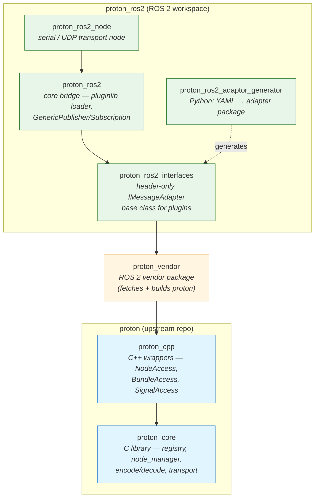

# Proton ROS 2

ROS 2 adapter for [Proton](https://github.com/clearpathrobotics/proton.git).

<<<<<<< HEAD
Documentation is available [here](https://docs.clearpathrobotics.com/docs_proton/proton_ros2)
=======
Official documentation can be found [here](https://docs.clearpathrobotics.com/docs_proton/proton_ros2/)

proton_ros2 relies on `pluginlib` to load user-defined "message adaptor" packages containing mappings between proton signals and ROS 2 messages. Message adaptor packages can be manually created, but we supply tools for automatically generating these packages based on the proton registry config.

## Package Hierarchy



## Packages

### proton_ros2

Core package for interfacing with protoncpp. Handles interfacing with the `node_manager` and `signal_registry` API's. Loads message adaptor packages via pluginlib. Subscribes to mapped topics for transmitting to proton peers, and publishes received proton bundles to ROS 2. Transport-related code is provided by **proton_ros2_node**, this package can be used standalone if you have a preferred Ethernet or serial interface package.

### proton_ros2_interfaces

Header-only package defining the base class for proton message mapping plugins. Necessary dependency for creating a message adaptor package.

### proton_ros2_adaptor_generator

Python scripts to create the message adaptor packages.

### proton_ros2_node

ROS 2 node handling serial and/or ethernet transport and transport-level verification of data.
>>>>>>> 5eaa8a7 (Add missed readme diagrams)

## Building

```
mkdir ~/proton_ws/src -p
cd ~/proton_ws/src
git clone https://github.com/clearpathrobotics/proton_ros2.git

cd ~/proton_ws
source /opt/ros/jazzy/setup.bash
colcon build --symlink-install
```

## Proton Source Options

By default, proton_ros2 uses `proton_vendor` which downloads and builds Proton from GitHub. For development with local Proton changes, you can use Proton from the same workspace:

1. Ensure `proton` and `proton_vendor` are cloned in the same workspace:
  `git clone https://github.com/clearpathrobotics/proton.git`
  `git clone https://github.com/clearpathrobotics/proton_vendor.git`
2. Build with `PROTON_VENDOR_USE_LOCAL=ON`: `colcon build --cmake-args -DPROTON_VENDOR_USE_LOCAL=ON --symlink-install`


## Running

```
source ~/proton_ws/install/setup.bash
ros2 launch proton_ros2 proton_ros2.launch.py config_file:=/path/to/config.yaml target:=target_node namespace:=/my_namespace
```